# Denoised Frames
We present denoising examples of increasing noise from $\sigma$=10 to  $\sigma$=50.
|Clean |Noisy |Wiener-4d CNN Raft (Ours) | DVDNet|
|---|---|---|---|
|  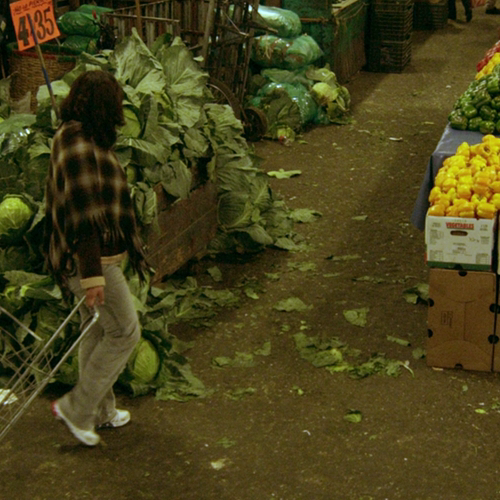 |  |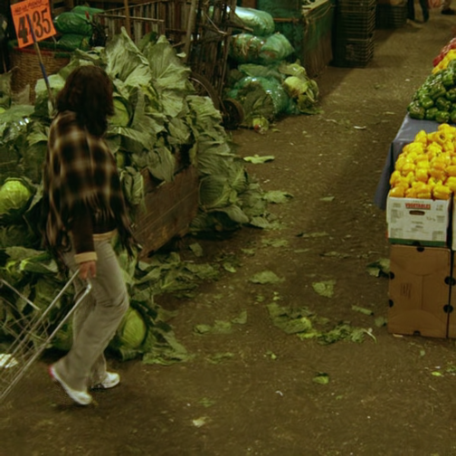  | |
|   |  |  |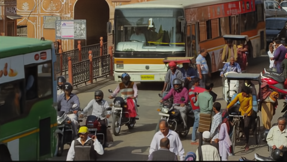 |
|  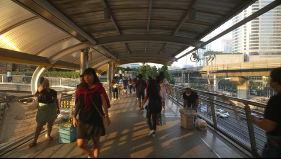 |  |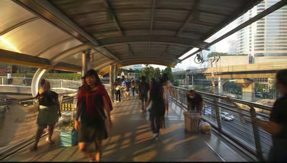  | |
|  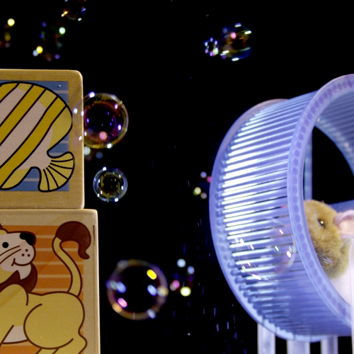 | 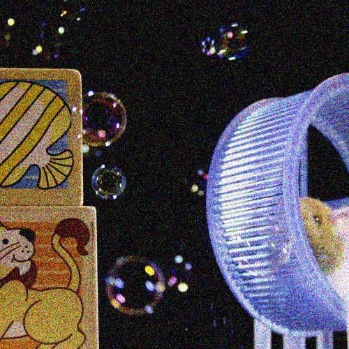 |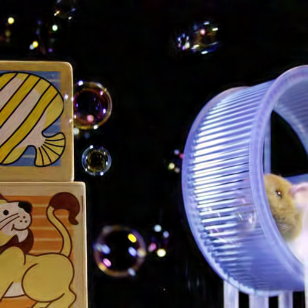  |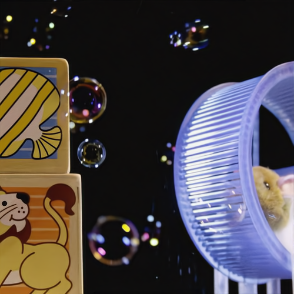 |
|   | 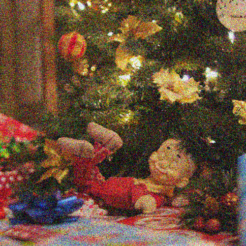 |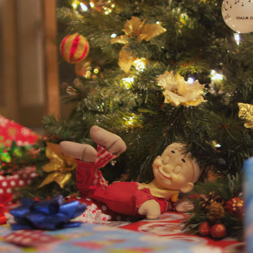  |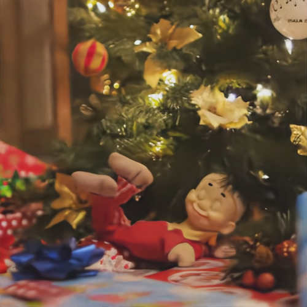 |
